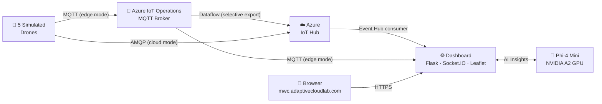
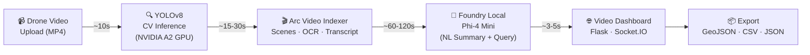
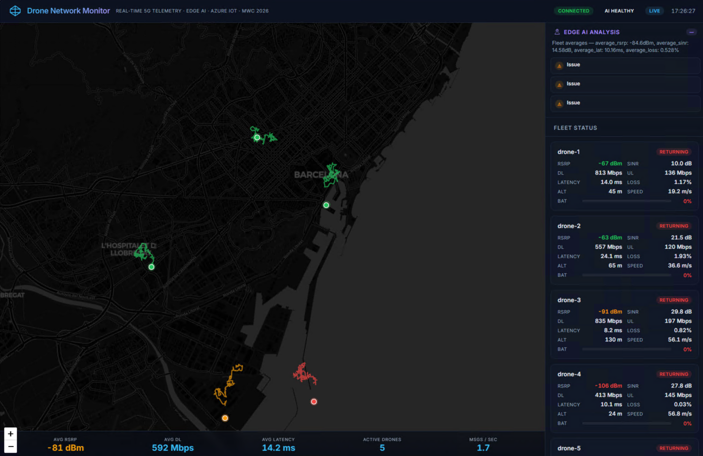
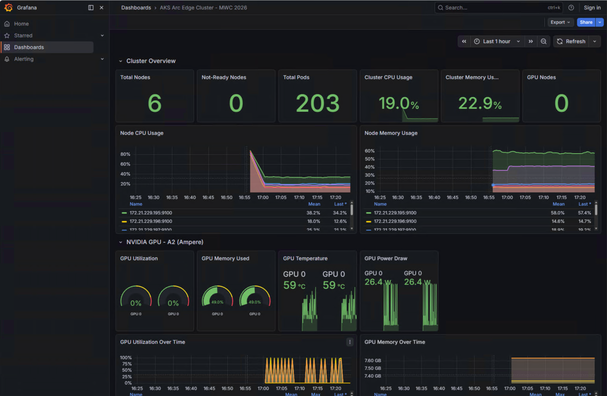
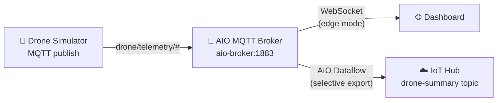

# Real-Time Drone Network Monitoring & Video Intelligence with Edge AI

**MWC 2026 Demo — Adaptive Cloud Lab**

Two interconnected edge AI demos running on **AKS Arc (Azure Local)** — showcasing real-time telemetry monitoring and AI-powered video intelligence, all on commodity edge hardware with full data sovereignty.

**Demo 1 — Drone Network Monitor:** A live kiosk showing autonomous drones monitoring 5G network quality across Barcelona. Drones patrol waypoints around 12 landmarks, return to base when battery is low, and are replaced by fresh drones with new callsigns — creating a continuous, realistic fleet lifecycle. The dashboard supports three telemetry data modes: **demo** (built-in synthetic data), **cloud** (Azure IoT Hub), and **edge** (Azure IoT Operations MQTT broker on-cluster). Phi-4 Mini running on an NVIDIA GPU at the edge provides real-time AI-powered insights.

**Demo 2 — Drone Video Intelligence:** Upload drone footage and watch AI process it end-to-end on-premises. A custom YOLOv8 model detects cellular antennas frame-by-frame on the GPU, **Arc Video Indexer** creates a searchable video timeline with scenes, transcription, and OCR, and **Foundry Local (Phi-4 Mini)** generates natural-language summaries and answers questions about the footage — all without any data leaving the edge.



> **All components run on AKS Arc (Azure Local)** — 2× Lenovo SE350 edge servers with an NVIDIA A2 GPU, connected to Azure via Arc. MetalLB provides the external IP; NGINX Ingress terminates TLS.
>
> *Detailed diagram with node IPs and platform services: [docs/architecture.md](docs/architecture.md)*
>
> *Deep dive — infrastructure, data flow, AI Insights on-premises, and edge computing details: [docs/explanation.md](docs/explanation.md)*

### Video Intelligence Pipeline



> *Dedicated deployment on the Mobile Azure Local stamp. Full demo guide: [docs/video-indexer-demo-guide.md](docs/video-indexer-demo-guide.md)*

---

## Demo in Action

### Drone Network Monitor Dashboard

Real-time kiosk UI showing 5 autonomous drones over Barcelona with live 5G telemetry and Edge AI insights powered by Phi-4 Mini running on an NVIDIA A2 GPU.



**What you're seeing:**
- **Left panel** — Dark-themed Leaflet map with live drone positions, flight trails, and color-coded signal indicators (green = strong, yellow = moderate, red = weak)
- **Right panel** — Per-drone telemetry cards showing RSRP, SINR, DL/UL throughput, latency, packet loss, altitude, speed, and battery level
- **Top-right** — Real-time connection status (`CONNECTED`), AI health indicator (`AI HEALTHY`), and live clock
- **Edge AI Analysis** — Rule-engine generates instant insights (signal degradation, battery alerts, coverage gaps) while Phi-4 Mini overlays a fleet health summary
- **Drone lifecycle** — Drones patrol waypoints, return to base at low battery, charge, and are replaced by new drones with NATO callsigns (Alpha → Zulu)
- **Bottom bar** — Fleet-wide aggregates: average RSRP, average DL throughput, average latency, active drone count, and messages/sec throughput

### Grafana Cluster & GPU Monitoring

Full observability stack with Prometheus, Grafana, and NVIDIA DCGM Exporter providing real-time cluster and GPU metrics.



**What you're seeing:**
- **Cluster Overview** — 6 nodes healthy, 203 pods running, 19% CPU / 23% memory utilization across the cluster
- **Node CPU & Memory** — Per-node time series showing resource consumption across all 6 Kubernetes nodes
- **NVIDIA GPU - A2 (Ampere)** — Real-time GPU utilization, VRAM usage (49%), temperature (59°C), and power draw (26.4W) for the NVIDIA A2 GPU running Phi-4 inference
- **GPU Time Series** — Utilization and memory trends over time, showing inference bursts from the AI analysis cycles


---

## Video Intelligence Demo — Full Breakdown

The Video Intelligence demo is a **second, dedicated AKS Arc cluster** on the Mobile Azure Local stamp that showcases the full AI lifecycle at the edge: drone video upload → computer vision detection → video indexing → generative AI summarization — all on-premises.

### How It Works (End-to-End)

The pipeline has four sequential stages, each emitting real-time progress updates via WebSocket to the browser:

```
MP4 Upload → CV Inference (YOLOv8 on GPU) → Arc Video Indexer → Foundry Local Summary
   ~10s            ~15-30s                      ~60-120s              ~3-5s
```

#### Stage 1: Video Upload

The user drags-and-drops an MP4 file onto the dashboard (or clicks browse). The Flask backend:

1. Saves the file to persistent storage (`/data/uploads/`)
2. Creates a SQLite record for tracking state across pod restarts
3. Adds the video to the in-memory video registry
4. Emits a `processing_started` WebSocket event to the browser
5. Spawns a background thread to run the processing pipeline
6. Returns `202 Accepted` immediately — the browser shows a live progress UI

#### Stage 2: CV Inference — YOLOv8 Object Detection

A **YOLOv8s** model fine-tuned for cellular antenna detection runs on the NVIDIA A2 GPU:

| Attribute | Value |
|---|---|
| Base model | YOLOv8s (Ultralytics) |
| Training data | Roboflow RF100 Cell Towers + custom drone frames |
| Classes | `cellular_antenna`, `microwave_dish`, and more |
| Input size | 640×640 |
| Format | ONNX (exported from PyTorch, runs via ONNX Runtime + CUDA) |
| Speed | ~5-10 ms/frame (100-200 FPS on NVIDIA A2) |
| VRAM | ~1 GB |

**Per-frame output:**

```json
{
  "frame": 1234,
  "timestamp_str": "00:00:41.133",
  "objects": [{
    "label": "cellular_antenna",
    "confidence": 0.91,
    "bbox_xyxy": [412, 128, 487, 256]
  }]
}
```

The pipeline processes every frame, applies Non-Maximum Suppression, and produces structured detection JSON with bounding boxes, confidence scores, and timestamps. This converts raw video pixels into **searchable, queryable events**.

> **Key insight:** *"This model was trained in Azure using cloud GPU compute, then exported as ONNX and deployed at the edge. Use the cloud for what it's good at (training), run inference where the data lives (the edge)."*

#### Stage 3: Arc Video Indexer — Video Intelligence at the Edge

**Azure AI Video Indexer enabled by Arc** runs as a Kubernetes extension directly on the cluster. After CV inference completes, the dashboard:

1. Uploads the video to Arc Video Indexer via the [Arc VI REST API](https://github.com/Azure-Samples/azure-video-indexer-samples/blob/master/VideoIndexerEnabledByArc/Documentation/VideoIndexerArcApis.md)
2. Polls status every 10 seconds (up to 30 minutes) — emitting `vi_progress` WebSocket events
3. On completion, retrieves full insights: **scenes, shots, transcript, OCR, labels, keywords, faces, emotions**
4. Persists the insights JSON to the SQLite database

**What Video Indexer adds on top of our custom CV model:**

| Capability | Source |
|---|---|
| Antenna detection + bounding boxes | Custom YOLOv8 pipeline |
| Scene segmentation + shot detection | Arc Video Indexer |
| Audio transcription | Arc Video Indexer |
| OCR (on-screen text extraction) | Arc Video Indexer |
| Face detection | Arc Video Indexer |
| Keyword + topic extraction | Arc Video Indexer |
| Searchable video timeline | Arc Video Indexer |

> *"Video Indexer handles the heavy lifting of video intelligence — transcription, scene detection, search. We augment it with our own custom vision model for domain-specific objects like cell tower antennas. Best of both worlds."*

**Authentication flow:**

```
Azure Service Principal (ClientSecretCredential)
  → ARM Management API /generateAccessToken
  → VI Bearer Token (cached ~58 min)
  → Used for all VI API calls (upload, poll, get insights)
```

#### Stage 4: Foundry Local — AI Summarization & Interactive Query

After both CV inference and Video Indexer complete, the dashboard calls **Foundry Local (Phi-4 Mini)** running on the same NVIDIA A2 GPU:

1. Combines detection metadata + VI insights into a structured prompt
2. Sends to the OpenAI-compatible `/v1/chat/completions` API endpoint
3. Phi-4 Mini generates a natural-language executive summary
4. The summary is stored and emitted via WebSocket as `analysis_complete`

**Domain-specific system prompt:**
> *"You are a drone video analyst working at a cell-tower inspection site. Given detection data from a drone flight analyzing cell tower antennas, provide a concise, professional summary of findings. Focus on structural integrity, anomalies, and maintenance recommendations."*

**Sample interaction:**
- **Visitor asks:** "What did the drone find?"
- **Foundry Local responds:** "The drone flight detected 3 cellular antenna panels across 2 tower structures. All detections occurred between timestamps 0:41 and 2:15, at altitudes of 45-60 meters. Average detection confidence was 87%. The antennas appear to be standard macro cell panels oriented in a tri-sector configuration."

Users can also ask follow-up questions via the dashboard's query input — each query sends the detection context + question to Phi-4 for contextual answers.

### Video Dashboard UI

A dark-themed kiosk web app (Flask + Socket.IO) where booth visitors can:

1. **Upload drone footage** — Drag-and-drop or browse for MP4 files
2. **Watch AI process the video** — Real-time 4-step progress: Upload → CV Detection → Video Indexing → AI Summary
3. **View detections** — Video player with canvas-overlay bounding boxes at antenna locations
4. **Browse the detection timeline** — Horizontal bar showing where in the video antennas were found
5. **Read the AI summary** — Foundry Local (Phi-4 Mini) provides a natural-language summary of findings
6. **Ask questions** — Type natural language queries: *"How many antennas were detected?" "Where are they located?"*
7. **Explore VI insights** — Scenes, keywords, faces, OCR text extracted by Video Indexer
8. **Export results** — Download detection data as GeoJSON, CSV, or JSON

**Dashboard layout:**

```
┌──────────────────────────────────────────────────────────────┐
│  Header: Title + Status Dots (AI/VI Health) + Clock          │
├─────────────────────────────────┬────────────────────────────┤
│ Left Column:                    │ Right Column:              │
│ • Video Player + Canvas Overlay │ • Stats (4 KPIs)           │
│ • Upload Zone (Drag & Drop)     │ • Detection Timeline Bar   │
│ • Processing Pipeline (4 steps) │ • AI Summary Card          │
│                                 │ • VI Insights Panel        │
│                                 │ • Detections Table         │
│                                 │ • NL Query Input           │
│                                 │ • Export Buttons            │
├─────────────────────────────────┴────────────────────────────┤
│ Footer: Video Tabs (horizontal scroll) + Upload Button       │
└──────────────────────────────────────────────────────────────┘
```

### GPU Budget (NVIDIA A2, 16 GB VRAM)

All three GPU workloads are time-sliced on a single NVIDIA A2 card:

| Workload | VRAM | Duration |
|---|---|---|
| Foundry Local (Phi-4 Mini) | ~8 GB | Always-on |
| YOLOv8s ONNX inference | ~1 GB | Per-video job (~30s) |
| Arc Video Indexer | ~4-6 GB | During indexing windows |
| **Headroom** | ~1-3 GB | Safety margin |

### Recovery & Resilience

The dashboard is designed for long-running kiosk operation:

- **Pod restart recovery** — On startup, loads previously processed videos from SQLite and resumes VI polling for any videos that were mid-processing when the pod crashed
- **Demo mode fallback** — If Foundry Local is unavailable, generates synthetic AI summaries and detection data so the demo always works
- **Graceful degradation** — If Video Indexer is down, the pipeline skips VI indexing and shows YOLO detections + Foundry summary only

### Deploying the Video Intelligence Demo

```powershell
# 1. Deploy Arc Video Indexer extension (requires Longhorn RWX storage)
.\scripts\06-deploy-video-indexer.ps1

# 2. Deploy the Foundry Local model for the VI cluster
kubectl apply -f k8s/vi-foundry-local.yaml

# 3. Build and deploy the Video Dashboard + CV inference container
.\scripts\07-deploy-video-dashboard.ps1

# 4. Verify everything is running
kubectl get pods -n video-analysis
kubectl get pods -n vi-foundry-mdl
```

**Video Dashboard URL:** `https://video.acx.mobile`

> *Full demo guide with talk tracks, timing, and fallback options: [docs/video-indexer-demo-guide.md](docs/video-indexer-demo-guide.md)*

### Cloud + Edge: The Model Training Story

This is a deliberate architectural choice worth highlighting:

| Phase | Where | Why |
|---|---|---|
| **Data labeling** | Azure (Roboflow / Custom Vision) | Cloud tools are better for collaborative labeling |
| **Model training** | Azure ML (cloud GPU) | Training needs lots of compute, but only once |
| **Model export** | Azure → ONNX | Open format, runs anywhere |
| **Inference** | Azure Local (edge GPU) | Where the data lives, low latency, data sovereignty |

> *"We used the cloud for what it's best at — scalable compute for training. Then we brought the trained model to the edge where the data lives. No raw video ever leaves these servers."*

---

## Architecture Overview

**Key components:**

| Component | Description |
|---|---|
| **AKS Arc (Azure Local)** | Kubernetes cluster on 2× Lenovo SE350 with NVIDIA A2 GPU |
| **Foundry Local Inference Operator** | Private Preview operator that manages SLM lifecycle on GPU nodes |
| **Phi-4 Mini Instruct** | Microsoft 14B-parameter SLM for edge AI inference |
| **Azure IoT Hub** | Cloud-managed device registry and D2C telemetry ingestion |
| **Azure IoT Operations (AIO)** | On-cluster MQTT broker (`aio-broker`) for edge-mode telemetry; AIO Dataflow selectively exports anonymized metrics to IoT Hub |
| **Drone Telemetry Simulator** | Python script simulating autonomous drones with waypoint patrols, battery return-to-base, and fleet cycling |
| **Live Dashboard** | Flask + Socket.IO + Leaflet.js real-time kiosk UI with rule-engine insights and Phi-4 AI summary; supports demo / cloud / edge data modes |
| **Arc Video Indexer** | Azure AI Video Indexer enabled by Arc — Kubernetes extension for on-premises video intelligence (scene detection, transcription, OCR, search) |
| **YOLOv8 CV Inference** | Custom-trained YOLOv8s model (ONNX) for cellular antenna detection on NVIDIA A2 GPU |
| **Video Intelligence Dashboard** | Flask + Socket.IO kiosk UI for video upload, real-time processing pipeline, AI summarization, NL query, and export |

---

## Prerequisites

| Requirement | Minimum | Notes |
|---|---|---|
| **Azure subscription** | Contributor role | For IoT Hub and AKS Arc resources |
| **Azure Local (HCI) cluster** | 2+ nodes with GPU | NVIDIA A2 or similar; `Standard_NC4_A2` VM SKU |
| **Azure CLI** | 2.60+ | With extensions: `connectedk8s`, `aksarc`, `azure-iot-ops`, `azure-iot` |
| **kubectl** | 1.28+ | Access via `az connectedk8s proxy` |
| **Helm** | 3.12+ | For cert-manager, trust-manager, Foundry operator |
| **Python** | 3.10+ | For simulator and dashboard |
| **Node/npm** | Optional | Not required for this demo |

---

## Quick Start (Run on Another Machine)

> **TL;DR** — If infrastructure is already deployed, skip to [Step 4](#step-4-run-the-dashboard).

### Step 1: Clone and configure

```powershell
git clone https://github.com/<org>/adaptivecloudlab-mwc26-demo.git
cd adaptivecloudlab-mwc26-demo

# Copy and fill in your environment config
cp config/aks_arc_cluster.env.sample config/aks_arc_cluster.env
# Edit config/aks_arc_cluster.env with your subscription, custom location, vnet, etc.
```

### Step 2: Deploy infrastructure (one-time)

Run the scripts in order. Each script is idempotent (safe to re-run).

```powershell
# Fix known az CLI extension directory issue on restricted hosts
$env:AZURE_EXTENSION_DIR = "$env:TEMP\az_extensions"

# 1. Create resource group, Key Vault, SSH keys, passwords
.\scripts\00-bootstrap-secrets.ps1

# 2. Create AKS Arc cluster with system, user, and GPU node pools
.\scripts\01-create-cluster.ps1

# 3. Install platform: NGINX ingress, cert-manager, trust-manager, Foundry Local, IoT Ops
.\scripts\02-install-platform.ps1

# 4. Deploy IoT Hub, register drone devices, generate simulator .env
.\scripts\03-deploy-iot-simulation.ps1
```

### Step 3: Deploy Foundry Local AI model

After the operator is installed, apply the model manifests:

```powershell
# Connect to the cluster
az connectedk8s proxy --name <cluster> --resource-group <rg>

# Deploy the Phi-4 model on the GPU node
kubectl apply -f k8s/foundry-local.yaml

# Watch the model download and deployment (takes ~3-5 min)
kubectl get modeldeployment -n foundry-local -w

# Verify the inference service is running
kubectl get svc -n foundry-local
```

> **Important:** If the Helm OCI install fails with `pending-install`, use the bundled `.tgz`:
> ```powershell
> helm install inference-operator ./inference-operator-0.0.1-prp.5.tgz \
>     -n foundry-local-operator --create-namespace --timeout 5m
> ```

### Step 4: Run the dashboard

```powershell
# Set up Python virtual environment
cd dashboard
python -m venv .venv
.venv\Scripts\Activate.ps1      # Windows
# source .venv/bin/activate     # Linux/macOS

pip install -r requirements.txt

# Copy and configure the dashboard environment
cp .env.sample .env
# Edit .env — fill in EDGE_AI_API_KEY and EDGE_AI_ENDPOINT (see below)

# Port-forward the Foundry Local inference service (in a separate terminal)
kubectl port-forward svc/phi-4-deployment -n foundry-local 8443:5000

# Run the dashboard
python app.py
```

#### How to get `EDGE_AI_ENDPOINT` and `EDGE_AI_API_KEY`

**`EDGE_AI_ENDPOINT`** — This is the local URL exposed by the `kubectl port-forward` command above. When you run `kubectl port-forward svc/phi-4-deployment -n foundry-local 8443:5000`, the endpoint becomes:

```
https://localhost:8443
```

> If you choose a different local port (e.g. `9443:5000`), update the endpoint accordingly (`https://localhost:9443`).

**`EDGE_AI_API_KEY`** — The API key is auto-generated by the Foundry Local Inference Operator and stored in a Kubernetes secret. Retrieve it with:

```powershell
# Get the API key from the Kubernetes secret
kubectl get secret phi-4-deployment-api-keys -n foundry-local -o jsonpath='{.data.api-key-primary}' | ForEach-Object { [System.Text.Encoding]::UTF8.GetString([System.Convert]::FromBase64String($_)) }
```

Or on Linux/macOS:

```bash
kubectl get secret phi-4-deployment-api-keys -n foundry-local \
  -o jsonpath='{.data.api-key-primary}' | base64 -d
```

The key will look like `fndry-pk-xxxxxxxx-xxxx-xxxx-xxxx-xxxxxxxxxxxx`. Paste it into your `dashboard/.env` file:

```env
EDGE_AI_ENDPOINT=https://localhost:8443
EDGE_AI_API_KEY=fndry-pk-xxxxxxxx-xxxx-xxxx-xxxx-xxxxxxxxxxxx
```

---

Open **http://localhost:5000** in a browser. The dashboard shows:
- Live Leaflet map of Barcelona with drone positions
- Real-time 5G telemetry cards (RSRP, RSRQ, SINR, throughput)
- AI-powered fleet insights from Phi-4 (updated every 15 seconds)
- Aggregate network statistics

### Step 5: Run the drone simulator (optional — dashboard has demo mode)

```powershell
cd iot-simulation

# Install dependencies
pip install azure-iot-device python-dotenv

# Ensure .env has connection strings (generated by script 03)
python drone-telemetry-simulator.py
```

---

## Containerized Deployment (Recommended)

The dashboard and simulator can run as containers directly on the AKS Arc cluster, eliminating the need for Python, port-forwarding, or local `.env` files. This is the recommended way to run the demo.

### Step 1: Build and push container images

```powershell
$env:AZURE_EXTENSION_DIR = "$env:TEMP\az_extensions"
$acr = "acxcontregwus2"  # Your ACR name
$loginServer = (az.cmd acr show --name $acr --query loginServerName -o tsv)

# Build images remotely in ACR (no local Docker needed)
az.cmd acr build -r $acr -t drone-demo/dashboard:latest ./dashboard
az.cmd acr build -r $acr -t drone-demo/simulator:latest ./iot-simulation
```

### Step 2: Create secrets and deploy

```powershell
# Run the deployment script (builds, pushes, creates secrets, applies manifests)
.\scripts\04-deploy-drone-demo.ps1
```

Or manually:

```powershell
# Create namespace
kubectl create namespace drone-demo

# Create ACR pull secret
$acrPwd = (az.cmd acr credential show --name $acr --query "passwords[0].value" -o tsv)
kubectl create secret docker-registry acr-pull-secret -n drone-demo \
  --docker-server=$loginServer --docker-username=$acr --docker-password=$acrPwd

# Create app secrets from .env files (API key, drone connection strings)
# See scripts/04-deploy-drone-demo.ps1 for the full secret creation commands

# Apply manifests (namespace, deployments, service, ingress, MetalLB, TLS)
kubectl apply -f k8s/metallb-config.yaml
# drone-demo.yaml is auto-rendered from the template by the deploy script
.\scripts\04-deploy-drone-demo.ps1 -SkipBuild
```

### Step 3: Verify deployment

```powershell
# Check pods are running
kubectl get pods -n drone-demo -o wide

# Check ingress has an external IP
kubectl get svc -n pdx-ingress

# Expected output: EXTERNAL-IP = 172.21.229.201
```

---

## Accessing the Demo

### From the AdaptiveCloudLab Network

The dashboard is accessible at:

> **https://mwc.adaptivecloudlab.com**

This URL is served by the NGINX Ingress controller on the AKS Arc cluster via MetalLB (VIP: `172.21.229.201`). A DNS A record for `mwc.adaptivecloudlab.com` points to this IP.

**Requirements:**
- You must be connected to the **AdaptiveCloudLab.com network** (the 172.21.229.x subnet must be routable from your machine)
- Accept the self-signed certificate warning in your browser (the TLS cert is issued by a self-signed ClusterIssuer)
- The dashboard auto-starts in demo mode with 5 simulated drones over Barcelona
- AI insights from Phi-4 (running on the GPU node) update every 15 seconds

### Network Details

| Component | Value |
|---|---|
| Dashboard URL | `https://mwc.adaptivecloudlab.com` |
| Grafana URL | `https://grafana.adaptivecloudlab.com` |
| MetalLB VIP | `172.21.229.201` |
| Ingress Controller | NGINX (namespace: `pdx-ingress`) |
| TLS | Self-signed cert via cert-manager |
| Ingress Host | `mwc.adaptivecloudlab.com` |
| Dashboard Pod | Runs on user pool nodes (`pdxuser`) |
| Simulator Pod | Runs on user pool nodes (`pdxuser`) |
| AI Endpoint (in-cluster) | `https://phi-4-deployment.foundry-local.svc:5000` |

---

## Project Structure

```
adaptivecloudlab-mwc26-demo/
├── README.md                           # This file
├── docs/
│   ├── architecture.md                 # Detailed Mermaid architecture diagram
│   ├── explanation.md                  # Deep dive: infrastructure, data flow, edge AI insights
│   ├── video-indexer-demo-guide.md     # Video Intelligence demo guide with talk tracks
│   └── images/
│       ├── drone-dashboard.png         # Drone Network Monitor screenshot
│       └── grafana-dashboard.png       # Grafana cluster & GPU dashboard screenshot
├── config/
│   ├── aks_arc_cluster.env.sample      # Infrastructure config template
│   ├── deployment.env.sample           # Deployment config template (ACR, DNS, etc.)
│   └── vi-mobile.env                   # Video Indexer cluster config (Mobile stamp)
├── scripts/
│   ├── 00-bootstrap-secrets.ps1        # RG, Key Vault, SSH keys, passwords
│   ├── 01-create-cluster.ps1           # AKS Arc cluster + node pools
│   ├── 02-install-platform.ps1         # Ingress, cert-mgr, Foundry, IoT Ops
│   ├── 03-deploy-iot-simulation.ps1    # IoT Hub, device registration
│   ├── 04-deploy-drone-demo.ps1        # Build containers, deploy to cluster
│   ├── 05-deploy-monitoring.ps1        # Prometheus, Grafana, DCGM GPU exporter
│   ├── 06-deploy-video-indexer.ps1     # Longhorn storage + Arc Video Indexer extension
│   └── 07-deploy-video-dashboard.ps1   # Build + deploy Video Intelligence dashboard
├── k8s/
│   ├── foundry-local.yaml             # Foundry Local Model + ModelDeployment CRDs (drone demo)
│   ├── vi-foundry-local.yaml          # Foundry Local for Video Intelligence cluster
│   ├── edge-ai.yaml                    # Ollama deployment (alternative GPU inference)
│   ├── iot-ops-dataflow.yaml           # AIO Dataflow for selective cloud export (data sovereignty)
│   ├── drone-demo.yaml.template       # Dashboard + Simulator K8s template (rendered at deploy time)
│   ├── drone-demo-secrets.yaml         # Secrets template (gitignored)
│   ├── video-dashboard.yaml            # Video Intelligence dashboard K8s manifests
│   ├── video-dashboard.yaml.template   # Video dashboard template (rendered at deploy time)
│   ├── cv-inference-job.yaml.template  # YOLOv8 batch inference K8s Job template
│   ├── metallb-config.yaml            # MetalLB IP pool + L2 advertisement
│   ├── monitoring-values.yaml         # Helm values for kube-prometheus-stack
│   ├── dcgm-values.yaml              # Helm values for NVIDIA DCGM GPU exporter
│   ├── grafana-dashboard.json         # Custom Grafana dashboard (cluster + GPU)
│   └── grafana-ingress.yaml           # Ingress for grafana.adaptivecloudlab.com
├── dashboard/
│   ├── app.py                          # Flask backend (telemetry + AI analysis)
│   ├── requirements.txt                # Python dependencies
│   ├── Dockerfile                      # Container build for dashboard
│   ├── .env.sample                     # Dashboard env template (no secrets)
│   ├── templates/
│   │   └── index.html                  # Main HTML template
│   └── static/
│       ├── css/style.css               # Dark-theme kiosk styles
│       └── js/app.js                   # Leaflet map + Socket.IO client
├── video-dashboard/
│   ├── app.py                          # Flask backend (video upload, pipeline orchestration, AI query)
│   ├── vi_client.py                    # Arc Video Indexer API client (auth, upload, poll, insights)
│   ├── requirements.txt                # Python dependencies (Flask, Socket.IO, azure-identity, httpx)
│   ├── Dockerfile                      # Container build (python:3.12-slim)
│   ├── .env.sample                     # Video dashboard env template
│   ├── templates/
│   │   └── index.html                  # Dark kiosk UI (video player, timeline, query, export)
│   └── static/
│       └── style.css                   # Neon green/cyan dark-theme styles
├── cv-inference/
│   ├── inference.py                    # YOLOv8 ONNX inference pipeline (frame-by-frame detection)
│   ├── postprocess.py                  # YOLO output → bounding boxes + NMS
│   ├── annotate.py                     # Draw detection overlays on video frames
│   ├── export_geojson.py               # Convert detections to GeoJSON FeatureCollection
│   ├── requirements.txt                # Dependencies (ultralytics, onnxruntime-gpu, opencv)
│   └── Dockerfile                      # CUDA 12.2 runtime container for GPU inference
├── iot-simulation/
│   ├── drone-telemetry-simulator.py    # 5-drone IoT Hub telemetry simulator
│   ├── Dockerfile                      # Container build for simulator
│   ├── iot-hub-deployment.bicep        # IoT Hub Bicep template
│   └── iot-device-creation.bicep       # Documentation (devices via CLI)
└── inference-operator-0.0.1-prp.5.tgz  # Foundry Local Helm chart (Private Preview)
```

---

## Dashboard Features

| Feature | Description |
|---|---|
| **Dark-theme kiosk mode** | Designed for large screens and event booths — auto-refreshing, no user interaction required |
| **Real-time Leaflet map** | Drone positions on a dark tile layer centered on Barcelona (Fira Gran Via) with colored flight trails and signal-strength indicators |
| **5G telemetry cards** | Per-drone metrics: RSRP (dBm), RSRQ (dB), SINR (dB), DL/UL throughput (Mbps), latency (ms), packet loss (%), altitude (m), speed (m/s), battery level |
| **Drone lifecycle** | Drones patrol 12 Barcelona waypoints, return to base at 18% battery, charge to 92%, and are replaced by new drones with cycling NATO callsigns (Alpha → Zulu) |
| **Edge AI Insights** | Rule-engine generates instant insights (signal degradation, battery alerts, coverage gaps); Phi-4 Mini overlays a one-sentence fleet health summary — no JSON parsing, fully reliable |
| **Fleet status badges** | Color-coded per-drone status: `PATROLLING` (green), `RETURNING` (yellow), `LAUNCHING` (blue), `CHARGING` (cyan), `LANDING` (orange), `EMERGENCY` (red) |
| **Aggregate statistics** | Bottom bar with fleet-wide averages: RSRP, DL throughput, latency, active drone count, and messages/sec |
| **Health indicators** | Top-right badges: WebSocket connection status (`CONNECTED`/`DISCONNECTED`), AI fleet health (`AI HEALTHY`/`AI DEGRADED`/`AI CRITICAL`), data mode (`LIVE`/`DEMO`), and live clock |
| **Demo mode** | Runs entirely with synthetic data when `DEMO_MODE=true` or `DATA_MODE` is unset — no IoT Hub connection needed |
| **Three data modes** | `demo` — built-in synthetic data; `cloud` — IoT Hub Event Hub consumer; `edge` — Azure IoT Operations MQTT broker (switch via `DATA_MODE` env var) |

### Drone Lifecycle

Each drone follows a continuous autonomous cycle:

1. **Launch** — New drone spawns at the Barcelona base station (`41.3545°N, 2.1279°E`) with a fresh NATO callsign and full battery
2. **Patrol** — Flies a waypoint-based route through 12 Barcelona landmarks (Sagrada Família, Park Güell, Camp Nou, Port Olímpic, etc.)
3. **Return** — When battery drops below 18%, drone automatically navigates back to base
4. **Retire & Replace** — Drone lands, is removed from the fleet, and a new drone with the next callsign (Alpha → Bravo → ... → Zulu → Alpha) launches after charging

This creates a realistic, ever-evolving fleet where drones continuously cycle through the city — ideal for long-running kiosk demos.

### AI Analysis Pipeline

The Edge AI analysis uses a two-layer approach for reliability:

1. **Rule Engine** (instant) — Deterministic analysis of fleet telemetry generates structured insights: signal degradation warnings, battery alerts, coverage gap detection, and network quality assessments
2. **Phi-4 Summary** (async) — The Edge AI model generates a one-sentence natural-language fleet health summary that overlays the rule-engine insights

Insights are emitted immediately via WebSocket with a 15-second polling fallback at `/api/ai-insights`.

---

## Data Modes

The dashboard supports three telemetry data modes, selectable via the `DATA_MODE` environment variable:

| Mode | `DATA_MODE` | Description |
|---|---|---|
| **Demo** | `demo` (or unset when `EVENTHUB_CONNECTION_STRING` is empty) | Built-in synthetic data generator — 5 drones simulated in-process, no external services needed. Ideal for quick local testing. If `DATA_MODE` is not set and no `EVENTHUB_CONNECTION_STRING` is provided, the dashboard automatically falls back to demo mode. |
| **Cloud** | `cloud` | Reads live telemetry from **Azure IoT Hub**'s built-in Event Hub endpoint. Requires `EVENTHUB_CONNECTION_STRING` and `EVENTHUB_CONSUMER_GROUP`. |
| **Edge** | `edge` | Subscribes to the **Azure IoT Operations (AIO) MQTT broker** running on-cluster. Requires `MQTT_BROKER_HOST` and `MQTT_TOPIC_PREFIX`. Telemetry stays on-premises; only anonymized metrics are exported to IoT Hub via AIO Dataflow. |

The active mode is shown in the top-right **LIVE** / **DEMO** badge of the dashboard.

### Switching modes

```env
# dashboard/.env

# Demo mode (no infrastructure required)
DATA_MODE=demo

# Cloud mode (IoT Hub)
DATA_MODE=cloud
EVENTHUB_CONNECTION_STRING=Endpoint=sb://...

# Edge mode (Azure IoT Operations MQTT)
DATA_MODE=edge
MQTT_BROKER_HOST=aio-broker-insecure.azure-iot-operations.svc
MQTT_BROKER_PORT=1883
MQTT_TOPIC_PREFIX=drone/telemetry
```

---

## Azure IoT Operations Integration

In **edge mode** (`DATA_MODE=edge`), the dashboard connects directly to the **Azure IoT Operations MQTT broker** (`aio-broker`) running on the cluster. This keeps all raw telemetry on-premises — no data leaves the edge until explicitly exported.

### Selective Cloud Export (Data Sovereignty)

The file `k8s/iot-ops-dataflow.yaml` defines an **AIO Dataflow** that selectively exports anonymized metrics to IoT Hub:

- **Source** — AIO local MQTT broker on topic `drone/telemetry/#`
- **Transformation** — Maps only key network metrics (RSRP, SINR, DL throughput, latency, packet loss); GPS coordinates are rounded to area-level precision (~1.1 km radius, `floor(lat × 100) / 100`) to prevent exact location exposure
- **Destination** — IoT Hub topic `drone-summary` via managed identity (no stored credentials)

This means exact drone positions and full sensor payloads remain on the Azure Local cluster, while only the network quality summary is forwarded to the cloud.



### Deploy the AIO Dataflow

```powershell
# Ensure AIO is installed (handled by 02-install-platform.ps1)
# Replace <your-hub> with your actual IoT Hub hostname (e.g. pdx-iothub.azure-devices.net)
$iotHubHost = "<your-hub>.azure-devices.net"
(Get-Content k8s/iot-ops-dataflow.yaml) -replace '\$\{IOT_HUB_HOSTNAME\}',$iotHubHost | kubectl apply -f -
```

---

## Foundry Local Details

The demo uses **Foundry Local Inference Operator** (Private Preview) to run Phi-4 Mini on a GPU node.

| Setting | Value |
|---|---|
| Operator version | `0.0.1-prp.5` |
| Chart | `inference-operator-0.0.1-prp.5.tgz` (bundled) |
| Namespace (operator) | `foundry-local-operator` |
| Namespace (workloads) | `foundry-local` |
| Model catalog alias | `phi-4-mini` |
| Model variant | `Phi-4-mini-instruct` |
| GPU | NVIDIA A2 (Ampere, 16 GB VRAM) |
| Service | `phi-4-deployment.foundry-local.svc:5000` (ClusterIP) |
| Auth | API key via `api-key` header |

**Dependencies:** cert-manager v1.19.2, trust-manager v0.20.3 (with `--secret-targets-enabled`).

### trust-manager patch (required)

After installing trust-manager, enable secret targets:

```powershell
# Add the --secret-targets-enabled arg
kubectl -n cert-manager patch deployment trust-manager --type=json -p '[
  {"op":"add","path":"/spec/template/spec/containers/0/args/-","value":"--secret-targets-enabled"}
]'

# Create RBAC for secret targets
kubectl apply -f - <<'EOF'
apiVersion: rbac.authorization.k8s.io/v1
kind: ClusterRole
metadata:
  name: trust-manager-secret-targets
rules:
  - apiGroups: [""]
    resources: ["secrets"]
    verbs: ["get","list","watch","create","update","patch","delete"]
---
apiVersion: rbac.authorization.k8s.io/v1
kind: ClusterRoleBinding
metadata:
  name: trust-manager-secret-targets
roleRef:
  apiGroup: rbac.authorization.k8s.io
  kind: ClusterRole
  name: trust-manager-secret-targets
subjects:
  - kind: ServiceAccount
    name: trust-manager
    namespace: cert-manager
EOF
```

---

## IoT Hub Configuration

| Setting | Value |
|---|---|
| Hub name | `${PREFIX}-iothub` (e.g. `pdx-iothub`) |
| SKU | S1 (1 unit) |
| Region | `southcentralus` |
| Devices | `drone-1` through `drone-5` |
| Consumer group | `drone-telemetry` |
| Connection strings | Stored in Key Vault as `${PREFIX}-drone-N-connstr` |

---

## Configuration Reference

### `config/aks_arc_cluster.env`

Primary configuration file. All resource names are auto-derived from `PREFIX`. Key variables:

| Variable | Description | Example |
|---|---|---|
| `PREFIX` | Naming prefix for all resources | `pdx` |
| `SUBSCRIPTION_ID` | Azure subscription GUID | `fbaf508b-...` |
| `CUSTOM_LOCATION_ID` | Azure Local custom location resource ID | `/subscriptions/.../customlocations/portland` |
| `AZURE_METADATA_LOCATION` | Azure region for metadata | `southcentralus` |
| `KUBERNETES_VERSION` | Target K8s version (≥1.29) | `1.32.6` |
| `VNET_RESOURCE_ID` | Azure Local logical network | `/subscriptions/.../logicalnetworks/pdx-lnet-vlan32` |
| `AAD_ADMIN_GROUP_IDS` | Entra ID group object IDs for RBAC | `be0c17dc-...,f5157bd2-...` |
| `DRONE_COUNT` | Number of simulated drones | `5` |
| `GPU_POOL_VM_SIZE` | GPU node SKU | `Standard_NC4_A2` |

### `dashboard/.env`

| Variable | Description | Default |
|---|---|---|
| `DEMO_MODE` | Use synthetic data (no IoT Hub) | `true` |
| `DATA_MODE` | Telemetry source: `demo`, `cloud` (IoT Hub), or `edge` (AIO MQTT) | `cloud` |
| `EDGE_AI_ENABLED` | Enable Foundry Local AI insights | `true` |
| `EDGE_AI_ENDPOINT` | Foundry Local API URL | `https://localhost:8443` (via `kubectl port-forward`) |
| `EDGE_AI_MODEL` | Model name for inference | `Phi-4-mini-instruct` |
| `EDGE_AI_API_KEY` | API key for Foundry Local | Retrieve from K8s secret — see [How to get EDGE_AI_API_KEY](#how-to-get-edge_ai_endpoint-and-edge_ai_api_key) |
| `EDGE_AI_INTERVAL` | Seconds between AI analysis cycles | `15` |
| `DRONE_COUNT` | Number of drones in demo mode | `5` |
| `DASHBOARD_PORT` | HTTP port | `5000` |
| `MQTT_BROKER_HOST` | AIO MQTT broker host (edge mode only) | `aio-broker-insecure.azure-iot-operations.svc` |
| `MQTT_BROKER_PORT` | AIO MQTT broker port (edge mode only) | `1883` |
| `MQTT_TOPIC_PREFIX` | MQTT topic prefix for drone telemetry (edge mode only) | `drone/telemetry` |

---

## Monitoring (Prometheus + Grafana)

The cluster includes a full observability stack deployed in the `monitoring` namespace, providing real-time visibility into cluster health, GPU utilization, and workload status.

### What's deployed

| Component | Chart / Version | Purpose |
|---|---|---|
| **Prometheus** | `kube-prometheus-stack` | Metrics collection, alerting rules, node-exporter, kube-state-metrics |
| **Grafana** | Bundled with kube-prometheus-stack | Dashboard visualization (5Gi persistent storage) |
| **DCGM Exporter** | `nvidia/dcgm-exporter` | NVIDIA GPU metrics (utilization, memory, temp, power) — runs on GPU node only |

### Access Grafana

> **https://grafana.adaptivecloudlab.com**
>
> Credentials: `admin` / `MWC26-Demo!`
>
> Anonymous viewer access is also enabled (no login required for read-only).

A DNS A record for `grafana.adaptivecloudlab.com` must point to `172.21.229.201` (same MetalLB VIP as the demo dashboard).

### Custom Dashboard: "AKS Arc Edge Cluster - MWC 2026"

Pre-provisioned via ConfigMap sidecar (`grafana-sc-dashboard` label). The dashboard auto-loads on Grafana startup with no manual import required.

**4 dashboard sections with 20+ panels:**

| Section | Panels | Key Metrics |
|---|---|---|
| **Cluster Overview** | 8 | Total nodes, not-ready nodes, total pods, cluster CPU/memory %, GPU node count, per-node CPU & memory time series |
| **NVIDIA GPU - A2 (Ampere)** | 6 | GPU utilization gauge, VRAM usage gauge, temperature (°C), power draw (W), utilization over time, memory over time |
| **Drone Demo Workloads** | 7 | Dashboard/simulator/Foundry Local pod status, IoT Ops pod count, container restarts, per-pod CPU & memory |
| **Network & Storage** | 4 | Node network RX/TX (bytes/sec), disk usage bar gauge, disk I/O time series |

### Deploy monitoring

```powershell
.\scripts\05-deploy-monitoring.ps1
```

To update just the dashboard ConfigMap without re-installing Helm charts:

```powershell
.\scripts\05-deploy-monitoring.ps1 -DashboardOnly
```

### Monitoring architecture

```
Prometheus ──scrape──> node-exporter (all 6 nodes)
           ──scrape──> kube-state-metrics
           ──scrape──> dcgm-exporter (GPU node only)
           ──scrape──> kubelet /metrics
                |
                v
           Grafana ──> Custom Dashboard (ConfigMap sidecar)
                |
                v
           NGINX Ingress ──> grafana.adaptivecloudlab.com
```

---

## Troubleshooting

| Symptom | Fix |
|---|---|
| `az` commands fail with extension errors | Set `$env:AZURE_EXTENSION_DIR = "$env:TEMP\az_extensions"` |
| PowerShell alias conflicts with `az` | Use `az.cmd` instead of `az` |
| `kubectl` auth errors on Arc cluster | Use `az connectedk8s proxy --name <cluster> --resource-group <rg>` (no `--token` flag) |
| Foundry Helm stuck in `pending-install` | Uninstall with `helm uninstall`, then install from local `.tgz` file |
| trust-manager `SecretTargetsDisabled` | Apply the RBAC + deployment patch in [trust-manager patch](#trust-manager-patch-required) |
| Model catalog alias not found | Use `phi-4-mini` (not `phi-4-mini-instruct`) |
| AI insights missing | Check that `simple-websocket` is installed (required for WebSocket transport); the dashboard also has a 15-second polling fallback at `/api/ai-insights` |
| Dashboard shows no data | Check `DEMO_MODE=true` in `.env` and that the port-forward is running |
| Edge mode shows no data | Verify `DATA_MODE=edge` and that the AIO MQTT broker is reachable at `MQTT_BROKER_HOST:MQTT_BROKER_PORT`; check dashboard logs for `[MQTT] Connection failed` |
| AIO Dataflow not exporting to IoT Hub | Confirm managed identity has `IoT Hub Data Contributor` role on the hub; check AIO Dataflow status with `kubectl get dataflow -n azure-iot-operations` |

---

## MetalLB Configuration

The AKS Arc cluster doesn't have a cloud load balancer by default. MetalLB v0.14.9 is deployed in L2 mode to assign external IPs to LoadBalancer services.

| Setting | Value |
|---|---|
| Mode | L2 Advertisement |
| IP Pool | `172.21.229.201/32` |
| Namespace | `metallb-system` |
| Config | `k8s/metallb-config.yaml` |

The NGINX Ingress controller service (`pdx-ingress` namespace) receives this IP and serves all Ingress resources.

---

## Hardware Reference

**2× Lenovo ThinkEdge SE350** (Azure Local cluster)

| Spec | Value |
|---|---|
| RAM | 128 GB per node (256 GB total) |
| GPU | 1× NVIDIA A2 per node (16 GB VRAM, Ampere) |
| K8s nodes | 6 total: 2 system, 2 user, 1 GPU, 1 control plane |
| OS | Azure Linux 3.0 |

---

## License

Internal Microsoft demo — Adaptive Cloud Lab, MWC 2026.