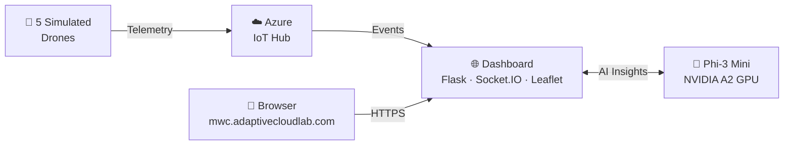

# Real-Time Drone Network Monitoring with Edge AI

**MWC 2026 Demo — Adaptive Cloud Lab**

A live kiosk demo showing five autonomous drones monitoring 5G network quality across the Barcelona MWC venue area. Telemetry flows through Azure IoT Hub, while a small language model (Phi-3 Mini) running on an NVIDIA GPU at the edge provides real-time AI-powered insights — all orchestrated on AKS Arc (Azure Local).



> **All components run on AKS Arc (Azure Local)** — 2× Lenovo SE350 edge servers with an NVIDIA A2 GPU, connected to Azure via Arc. MetalLB provides the external IP; NGINX Ingress terminates TLS.
>
> *Detailed diagram with node IPs and platform services: [docs/architecture.md](docs/architecture.md)*

---

## Demo in Action

### Drone Network Monitor Dashboard

Real-time kiosk UI showing 5 autonomous drones over Barcelona with live 5G telemetry and Edge AI insights powered by Phi-3 Mini running on an NVIDIA A2 GPU.


**What you're seeing:**
- **Left panel** — Dark-themed Leaflet map with live drone positions, flight trails, and color-coded signal indicators (green = strong, yellow = moderate, red = weak)
- **Right panel** — Per-drone telemetry cards showing RSRP, SINR, DL/UL throughput, latency, packet loss, altitude, speed, and battery level
- **Top-right** — Real-time connection status (`CONNECTED`), AI health indicator (`AI HEALTHY`), and live clock
- **Edge AI Analysis** — Phi-3 Mini analyzes fleet-wide telemetry every 15 seconds and surfaces actionable insights (signal degradation, coverage gaps, drone health)
- **Bottom bar** — Fleet-wide aggregates: average RSRP, average DL throughput, average latency, active drone count, and messages/sec throughput

### Grafana Cluster & GPU Monitoring

Full observability stack with Prometheus, Grafana, and NVIDIA DCGM Exporter providing real-time cluster and GPU metrics.


**What you're seeing:**
- **Cluster Overview** — 6 nodes healthy, 203 pods running, 19% CPU / 23% memory utilization across the cluster
- **Node CPU & Memory** — Per-node time series showing resource consumption across all 6 Kubernetes nodes
- **NVIDIA GPU - A2 (Ampere)** — Real-time GPU utilization, VRAM usage (49%), temperature (59°C), and power draw (26.4W) for the NVIDIA A2 GPU running Phi-3 inference
- **GPU Time Series** — Utilization and memory trends over time, showing inference bursts from the AI analysis cycles


---

## Architecture Overview

**Key components:**

| Component | Description |
|---|---|
| **AKS Arc (Azure Local)** | Kubernetes cluster on 2× Lenovo SE350 with NVIDIA A2 GPU |
| **Foundry Local Inference Operator** | Private Preview operator that manages SLM lifecycle on GPU nodes |
| **Phi-3 Mini 4K Instruct** | Microsoft 3.8B-parameter SLM for edge AI inference |
| **Azure IoT Hub** | Cloud-managed device registry and D2C telemetry ingestion |
| **Drone Telemetry Simulator** | Python script simulating 5 drones with 5G telemetry |
| **Live Dashboard** | Flask + Socket.IO + Leaflet.js real-time kiosk UI |

---

## Prerequisites

| Requirement | Minimum | Notes |
|---|---|---|
| **Azure subscription** | Contributor role | For IoT Hub and AKS Arc resources |
| **Azure Local (HCI) cluster** | 2+ nodes with GPU | NVIDIA A2 or similar; `Standard_NC4_A2` VM SKU |
| **Azure CLI** | 2.60+ | With extensions: `connectedk8s`, `aksarc`, `azure-iot-ops`, `azure-iot` |
| **kubectl** | 1.28+ | Access via `az connectedk8s proxy` |
| **Helm** | 3.12+ | For cert-manager, trust-manager, Foundry operator |
| **Python** | 3.10+ | For simulator and dashboard |
| **Node/npm** | Optional | Not required for this demo |

---

## Quick Start (Run on Another Machine)

> **TL;DR** — If infrastructure is already deployed, skip to [Step 4](#step-4-run-the-dashboard).

### Step 1: Clone and configure

```powershell
git clone https://github.com/<org>/adaptivecloudlab-mwc26-demo.git
cd adaptivecloudlab-mwc26-demo

# Copy and fill in your environment config
cp config/aks_arc_cluster.env.sample config/aks_arc_cluster.env
# Edit config/aks_arc_cluster.env with your subscription, custom location, vnet, etc.
```

### Step 2: Deploy infrastructure (one-time)

Run the scripts in order. Each script is idempotent (safe to re-run).

```powershell
# Fix known az CLI extension directory issue on restricted hosts
$env:AZURE_EXTENSION_DIR = "$env:TEMP\az_extensions"

# 1. Create resource group, Key Vault, SSH keys, passwords
.\scripts\00-bootstrap-secrets.ps1

# 2. Create AKS Arc cluster with system, user, and GPU node pools
.\scripts\01-create-cluster.ps1

# 3. Install platform: NGINX ingress, cert-manager, trust-manager, Foundry Local, IoT Ops
.\scripts\02-install-platform.ps1

# 4. Deploy IoT Hub, register drone devices, generate simulator .env
.\scripts\03-deploy-iot-simulation.ps1
```

### Step 3: Deploy Foundry Local AI model

After the operator is installed, apply the model manifests:

```powershell
# Connect to the cluster
az connectedk8s proxy --name <cluster> --resource-group <rg>

# Deploy the Phi-3 model on the GPU node
kubectl apply -f k8s/foundry-local.yaml

# Watch the model download and deployment (takes ~3-5 min)
kubectl get modeldeployment -n foundry-local -w

# Verify the inference service is running
kubectl get svc -n foundry-local
```

> **Important:** If the Helm OCI install fails with `pending-install`, use the bundled `.tgz`:
> ```powershell
> helm install inference-operator ./inference-operator-0.0.1-prp.5.tgz \
>     -n foundry-local-operator --create-namespace --timeout 5m
> ```

### Step 4: Run the dashboard

```powershell
# Set up Python virtual environment
cd dashboard
python -m venv .venv
.venv\Scripts\Activate.ps1      # Windows
# source .venv/bin/activate     # Linux/macOS

pip install -r requirements.txt

# Copy and configure the dashboard environment
cp .env.sample .env
# Edit .env — fill in EDGE_AI_API_KEY and EDGE_AI_ENDPOINT (see below)

# Port-forward the Foundry Local inference service (in a separate terminal)
kubectl port-forward svc/phi-3-deployment -n foundry-local 8443:5000

# Run the dashboard
python app.py
```

#### How to get `EDGE_AI_ENDPOINT` and `EDGE_AI_API_KEY`

**`EDGE_AI_ENDPOINT`** — This is the local URL exposed by the `kubectl port-forward` command above. When you run `kubectl port-forward svc/phi-3-deployment -n foundry-local 8443:5000`, the endpoint becomes:

```
https://localhost:8443
```

> If you choose a different local port (e.g. `9443:5000`), update the endpoint accordingly (`https://localhost:9443`).

**`EDGE_AI_API_KEY`** — The API key is auto-generated by the Foundry Local Inference Operator and stored in a Kubernetes secret. Retrieve it with:

```powershell
# Get the API key from the Kubernetes secret
kubectl get secret phi-3-deployment-api-keys -n foundry-local -o jsonpath='{.data.api-key-primary}' | ForEach-Object { [System.Text.Encoding]::UTF8.GetString([System.Convert]::FromBase64String($_)) }
```

Or on Linux/macOS:

```bash
kubectl get secret phi-3-deployment-api-keys -n foundry-local \
  -o jsonpath='{.data.api-key-primary}' | base64 -d
```

The key will look like `fndry-pk-xxxxxxxx-xxxx-xxxx-xxxx-xxxxxxxxxxxx`. Paste it into your `dashboard/.env` file:

```env
EDGE_AI_ENDPOINT=https://localhost:8443
EDGE_AI_API_KEY=fndry-pk-xxxxxxxx-xxxx-xxxx-xxxx-xxxxxxxxxxxx
```

---

Open **http://localhost:5000** in a browser. The dashboard shows:
- Live Leaflet map of Barcelona with drone positions
- Real-time 5G telemetry cards (RSRP, RSRQ, SINR, throughput)
- AI-powered fleet insights from Phi-3 (updated every 15 seconds)
- Aggregate network statistics

### Step 5: Run the drone simulator (optional — dashboard has demo mode)

```powershell
cd iot-simulation

# Install dependencies
pip install azure-iot-device python-dotenv

# Ensure .env has connection strings (generated by script 03)
python drone-telemetry-simulator.py
```

---

## Containerized Deployment (Recommended)

The dashboard and simulator can run as containers directly on the AKS Arc cluster, eliminating the need for Python, port-forwarding, or local `.env` files. This is the recommended way to run the demo.

### Step 1: Build and push container images

```powershell
$env:AZURE_EXTENSION_DIR = "$env:TEMP\az_extensions"
$acr = "acxcontregwus2"  # Your ACR name
$loginServer = (az.cmd acr show --name $acr --query loginServerName -o tsv)

# Build images remotely in ACR (no local Docker needed)
az.cmd acr build -r $acr -t drone-demo/dashboard:latest ./dashboard
az.cmd acr build -r $acr -t drone-demo/simulator:latest ./iot-simulation
```

### Step 2: Create secrets and deploy

```powershell
# Run the deployment script (builds, pushes, creates secrets, applies manifests)
.\scripts\04-deploy-drone-demo.ps1
```

Or manually:

```powershell
# Create namespace
kubectl create namespace drone-demo

# Create ACR pull secret
$acrPwd = (az.cmd acr credential show --name $acr --query "passwords[0].value" -o tsv)
kubectl create secret docker-registry acr-pull-secret -n drone-demo \
  --docker-server=$loginServer --docker-username=$acr --docker-password=$acrPwd

# Create app secrets from .env files (API key, drone connection strings)
# See scripts/04-deploy-drone-demo.ps1 for the full secret creation commands

# Apply manifests (namespace, deployments, service, ingress, MetalLB, TLS)
kubectl apply -f k8s/metallb-config.yaml
# drone-demo.yaml is auto-rendered from the template by the deploy script
.\scripts\04-deploy-drone-demo.ps1 -SkipBuild
```

### Step 3: Verify deployment

```powershell
# Check pods are running
kubectl get pods -n drone-demo -o wide

# Check ingress has an external IP
kubectl get svc -n pdx-ingress

# Expected output: EXTERNAL-IP = 172.21.229.201
```

---

## Accessing the Demo

### From the AdaptiveCloudLab Network

The dashboard is accessible at:

> **https://mwc.adaptivecloudlab.com**

This URL is served by the NGINX Ingress controller on the AKS Arc cluster via MetalLB (VIP: `172.21.229.201`). A DNS A record for `mwc.adaptivecloudlab.com` points to this IP.

**Requirements:**
- You must be connected to the **AdaptiveCloudLab.com network** (the 172.21.229.x subnet must be routable from your machine)
- Accept the self-signed certificate warning in your browser (the TLS cert is issued by a self-signed ClusterIssuer)
- The dashboard auto-starts in demo mode with 5 simulated drones over Barcelona
- AI insights from Phi-3 (running on the GPU node) update every 15 seconds

### Network Details

| Component | Value |
|---|---|
| Dashboard URL | `https://mwc.adaptivecloudlab.com` |
| Grafana URL | `https://grafana.adaptivecloudlab.com` |
| MetalLB VIP | `172.21.229.201` |
| Ingress Controller | NGINX (namespace: `pdx-ingress`) |
| TLS | Self-signed cert via cert-manager |
| Ingress Host | `mwc.adaptivecloudlab.com` |
| Dashboard Pod | Runs on user pool nodes (`pdxuser`) |
| Simulator Pod | Runs on user pool nodes (`pdxuser`) |
| AI Endpoint (in-cluster) | `https://phi-3-deployment.foundry-local.svc:5000` |

---

## Project Structure

```
adaptivecloudlab-mwc26-demo/
├── README.md                           # This file
├── docs/
│   ├── architecture.md                 # Detailed Mermaid architecture diagram
│   └── images/
│       ├── drone-dashboard.png         # Drone Network Monitor screenshot
│       └── grafana-dashboard.png       # Grafana cluster & GPU dashboard screenshot
├── config/
│   ├── aks_arc_cluster.env.sample      # Infrastructure config template
│   └── deployment.env.sample           # Deployment config template (ACR, DNS, etc.)
├── scripts/
│   ├── 00-bootstrap-secrets.ps1        # RG, Key Vault, SSH keys, passwords
│   ├── 01-create-cluster.ps1           # AKS Arc cluster + node pools
│   ├── 02-install-platform.ps1         # Ingress, cert-mgr, Foundry, IoT Ops
│   ├── 03-deploy-iot-simulation.ps1    # IoT Hub, device registration
│   ├── 04-deploy-drone-demo.ps1        # Build containers, deploy to cluster
│   └── 05-deploy-monitoring.ps1        # Prometheus, Grafana, DCGM GPU exporter
├── k8s/
│   ├── foundry-local.yaml             # Foundry Local Model + ModelDeployment CRDs
│   ├── drone-demo.yaml.template       # Dashboard + Simulator K8s template (rendered at deploy time)
│   ├── drone-demo-secrets.yaml         # Secrets template (gitignored)
│   ├── metallb-config.yaml            # MetalLB IP pool + L2 advertisement
│   ├── monitoring-values.yaml         # Helm values for kube-prometheus-stack
│   ├── dcgm-values.yaml              # Helm values for NVIDIA DCGM GPU exporter
│   ├── grafana-dashboard.json         # Custom Grafana dashboard (cluster + GPU)
│   └── grafana-ingress.yaml           # Ingress for grafana.adaptivecloudlab.com
├── dashboard/
│   ├── app.py                          # Flask backend (telemetry + AI analysis)
│   ├── requirements.txt                # Python dependencies
│   ├── Dockerfile                      # Container build for dashboard
│   ├── .env.sample                     # Dashboard env template (no secrets)
│   ├── templates/
│   │   └── index.html                  # Main HTML template
│   └── static/
│       ├── css/style.css               # Dark-theme kiosk styles
│       └── js/app.js                   # Leaflet map + Socket.IO client
├── iot-simulation/
│   ├── drone-telemetry-simulator.py    # 5-drone IoT Hub telemetry simulator
│   ├── Dockerfile                      # Container build for simulator
│   ├── iot-hub-deployment.bicep        # IoT Hub Bicep template
│   └── iot-device-creation.bicep       # Documentation (devices via CLI)
└── inference-operator-0.0.1-prp.5.tgz  # Foundry Local Helm chart (Private Preview)
```

---

## Dashboard Features

| Feature | Description |
|---|---|
| **Dark-theme kiosk mode** | Designed for large screens and event booths — auto-refreshing, no user interaction required |
| **Real-time Leaflet map** | Drone positions on a dark tile layer centered on Barcelona (Fira Gran Via) with colored flight trails and signal-strength indicators |
| **5G telemetry cards** | Per-drone metrics: RSRP (dBm), SINR (dB), DL/UL throughput (Mbps), latency (ms), packet loss (%), altitude (m), speed (m/s), battery level |
| **Edge AI Insights** | Phi-3 Mini analyzes fleet telemetry every 15 seconds — surfaces signal degradation, coverage gaps, and recommended actions via JSON insights |
| **Fleet status badges** | Color-coded per-drone status: `PATROLLING` (green), `RETURNING` (yellow), `EMERGENCY` (red) |
| **Aggregate statistics** | Bottom bar with fleet-wide averages: RSRP, DL throughput, latency, active drone count, and messages/sec |
| **Health indicators** | Top-right badges: WebSocket connection status, AI model health, live clock |
| **Demo mode** | Runs entirely with synthetic data when `DEMO_MODE=true` — no IoT Hub connection needed |

---

## Foundry Local Details

The demo uses **Foundry Local Inference Operator** (Private Preview) to run Phi-3 Mini on a GPU node.

| Setting | Value |
|---|---|
| Operator version | `0.0.1-prp.5` |
| Chart | `inference-operator-0.0.1-prp.5.tgz` (bundled) |
| Namespace (operator) | `foundry-local-operator` |
| Namespace (workloads) | `foundry-local` |
| Model catalog alias | `phi-3-mini-4k` |
| Model variant | `Phi-3-mini-4k-instruct-cuda-gpu:1` |
| GPU | NVIDIA A2 (Ampere, 16 GB VRAM) |
| Service | `phi-3-deployment.foundry-local.svc:5000` (ClusterIP) |
| Auth | API key via `api-key` header |

**Dependencies:** cert-manager v1.19.2, trust-manager v0.20.3 (with `--secret-targets-enabled`).

### trust-manager patch (required)

After installing trust-manager, enable secret targets:

```powershell
# Add the --secret-targets-enabled arg
kubectl -n cert-manager patch deployment trust-manager --type=json -p '[
  {"op":"add","path":"/spec/template/spec/containers/0/args/-","value":"--secret-targets-enabled"}
]'

# Create RBAC for secret targets
kubectl apply -f - <<'EOF'
apiVersion: rbac.authorization.k8s.io/v1
kind: ClusterRole
metadata:
  name: trust-manager-secret-targets
rules:
  - apiGroups: [""]
    resources: ["secrets"]
    verbs: ["get","list","watch","create","update","patch","delete"]
---
apiVersion: rbac.authorization.k8s.io/v1
kind: ClusterRoleBinding
metadata:
  name: trust-manager-secret-targets
roleRef:
  apiGroup: rbac.authorization.k8s.io
  kind: ClusterRole
  name: trust-manager-secret-targets
subjects:
  - kind: ServiceAccount
    name: trust-manager
    namespace: cert-manager
EOF
```

---

## IoT Hub Configuration

| Setting | Value |
|---|---|
| Hub name | `${PREFIX}-iothub` (e.g. `pdx-iothub`) |
| SKU | S1 (1 unit) |
| Region | `southcentralus` |
| Devices | `drone-1` through `drone-5` |
| Consumer group | `drone-telemetry` |
| Connection strings | Stored in Key Vault as `${PREFIX}-drone-N-connstr` |

---

## Configuration Reference

### `config/aks_arc_cluster.env`

Primary configuration file. All resource names are auto-derived from `PREFIX`. Key variables:

| Variable | Description | Example |
|---|---|---|
| `PREFIX` | Naming prefix for all resources | `pdx` |
| `SUBSCRIPTION_ID` | Azure subscription GUID | `fbaf508b-...` |
| `CUSTOM_LOCATION_ID` | Azure Local custom location resource ID | `/subscriptions/.../customlocations/portland` |
| `AZURE_METADATA_LOCATION` | Azure region for metadata | `southcentralus` |
| `KUBERNETES_VERSION` | Target K8s version (≥1.29) | `1.32.6` |
| `VNET_RESOURCE_ID` | Azure Local logical network | `/subscriptions/.../logicalnetworks/pdx-lnet-vlan32` |
| `AAD_ADMIN_GROUP_IDS` | Entra ID group object IDs for RBAC | `be0c17dc-...,f5157bd2-...` |
| `DRONE_COUNT` | Number of simulated drones | `5` |
| `GPU_POOL_VM_SIZE` | GPU node SKU | `Standard_NC4_A2` |

### `dashboard/.env`

| Variable | Description | Default |
|---|---|---|
| `DEMO_MODE` | Use synthetic data (no IoT Hub) | `true` |
| `EDGE_AI_ENABLED` | Enable Foundry Local AI insights | `true` |
| `EDGE_AI_ENDPOINT` | Foundry Local API URL | `https://localhost:8443` (via `kubectl port-forward`) |
| `EDGE_AI_MODEL` | Model name for inference | `Phi-3-mini-4k-instruct-cuda-gpu:1` |
| `EDGE_AI_API_KEY` | API key for Foundry Local | Retrieve from K8s secret — see [How to get EDGE_AI_API_KEY](#how-to-get-edge_ai_endpoint-and-edge_ai_api_key) |
| `EDGE_AI_INTERVAL` | Seconds between AI analysis cycles | `15` |
| `DRONE_COUNT` | Number of drones in demo mode | `5` |
| `DASHBOARD_PORT` | HTTP port | `5000` |

---

## Monitoring (Prometheus + Grafana)

The cluster includes a full observability stack deployed in the `monitoring` namespace, providing real-time visibility into cluster health, GPU utilization, and workload status.

### What's deployed

| Component | Chart / Version | Purpose |
|---|---|---|
| **Prometheus** | `kube-prometheus-stack` | Metrics collection, alerting rules, node-exporter, kube-state-metrics |
| **Grafana** | Bundled with kube-prometheus-stack | Dashboard visualization (5Gi persistent storage) |
| **DCGM Exporter** | `nvidia/dcgm-exporter` | NVIDIA GPU metrics (utilization, memory, temp, power) — runs on GPU node only |

### Access Grafana

> **https://grafana.adaptivecloudlab.com**
>
> Credentials: `admin` / `MWC26-Demo!`
>
> Anonymous viewer access is also enabled (no login required for read-only).

A DNS A record for `grafana.adaptivecloudlab.com` must point to `172.21.229.201` (same MetalLB VIP as the demo dashboard).

### Custom Dashboard: "AKS Arc Edge Cluster - MWC 2026"

Pre-provisioned via ConfigMap sidecar (`grafana-sc-dashboard` label). The dashboard auto-loads on Grafana startup with no manual import required.

**4 dashboard sections with 20+ panels:**

| Section | Panels | Key Metrics |
|---|---|---|
| **Cluster Overview** | 8 | Total nodes, not-ready nodes, total pods, cluster CPU/memory %, GPU node count, per-node CPU & memory time series |
| **NVIDIA GPU - A2 (Ampere)** | 6 | GPU utilization gauge, VRAM usage gauge, temperature (°C), power draw (W), utilization over time, memory over time |
| **Drone Demo Workloads** | 7 | Dashboard/simulator/Foundry Local pod status, IoT Ops pod count, container restarts, per-pod CPU & memory |
| **Network & Storage** | 4 | Node network RX/TX (bytes/sec), disk usage bar gauge, disk I/O time series |

### Deploy monitoring

```powershell
.\scripts\05-deploy-monitoring.ps1
```

To update just the dashboard ConfigMap without re-installing Helm charts:

```powershell
.\scripts\05-deploy-monitoring.ps1 -DashboardOnly
```

### Monitoring architecture

```
Prometheus ──scrape──> node-exporter (all 6 nodes)
           ──scrape──> kube-state-metrics
           ──scrape──> dcgm-exporter (GPU node only)
           ──scrape──> kubelet /metrics
                |
                v
           Grafana ──> Custom Dashboard (ConfigMap sidecar)
                |
                v
           NGINX Ingress ──> grafana.adaptivecloudlab.com
```

---

## Troubleshooting

| Symptom | Fix |
|---|---|
| `az` commands fail with extension errors | Set `$env:AZURE_EXTENSION_DIR = "$env:TEMP\az_extensions"` |
| PowerShell alias conflicts with `az` | Use `az.cmd` instead of `az` |
| `kubectl` auth errors on Arc cluster | Use `az connectedk8s proxy --name <cluster> --resource-group <rg>` (no `--token` flag) |
| Foundry Helm stuck in `pending-install` | Uninstall with `helm uninstall`, then install from local `.tgz` file |
| trust-manager `SecretTargetsDisabled` | Apply the RBAC + deployment patch in [trust-manager patch](#trust-manager-patch-required) |
| Model catalog alias not found | Use `phi-3-mini-4k` (not `phi-3-mini-4k-instruct`) |
| AI insights empty or malformed | Expected — Phi-3 output is variable; the dashboard has multi-layer JSON repair and text fallback |
| Dashboard shows no data | Check `DEMO_MODE=true` in `.env` and that the port-forward is running |

---

## MetalLB Configuration

The AKS Arc cluster doesn't have a cloud load balancer by default. MetalLB v0.14.9 is deployed in L2 mode to assign external IPs to LoadBalancer services.

| Setting | Value |
|---|---|
| Mode | L2 Advertisement |
| IP Pool | `172.21.229.201/32` |
| Namespace | `metallb-system` |
| Config | `k8s/metallb-config.yaml` |

The NGINX Ingress controller service (`pdx-ingress` namespace) receives this IP and serves all Ingress resources.

---

## Hardware Reference

**2× Lenovo ThinkEdge SE350** (Azure Local cluster)

| Spec | Value |
|---|---|
| RAM | 128 GB per node (256 GB total) |
| GPU | 1× NVIDIA A2 per node (16 GB VRAM, Ampere) |
| K8s nodes | 6 total: 2 system, 2 user, 1 GPU, 1 control plane |
| OS | Azure Linux 3.0 |

---

## License

Internal Microsoft demo — Adaptive Cloud Lab, MWC 2026.