# Architecture Diagram

> **Note (MWC 2026):** The **Portland stamp** is the active demo environment and also serves as the
> backup Video Indexer deployment. The Mobile stamp is unavailable (in transit to the conference).
> Portland runs both the Drone Network Monitoring demo **and** all Video Indexer components.

```mermaid
graph TB
    subgraph Cloud["☁️ Azure Cloud (South Central US)"]
        IoTHub["Azure IoT Hub<br/><i>pdx-iothub (S1)</i><br/>Device Registry + D2C Telemetry"]
        KV["Azure Key Vault<br/><i>pdx-kv</i><br/>Connection Strings"]
        ACR["Azure Container Registry<br/><i>acxcontregwus2 (Premium)</i><br/>Dashboard & Simulator Images"]
        Arc["Azure Arc<br/>Connected Cluster"]
    end

    subgraph AKSArc["🖥️ AKS Arc on Azure Local (Portland) — 2× Lenovo SE350 — Drone Demo + Video Indexer"]
        subgraph ControlPlane["Control Plane Node"]
            CP["moc-l4kkzr6yfnr<br/>172.21.229.195"]
        end

        subgraph SystemPool["System Node Pool (nodepool1)"]
            S1Node["moc-lk28q8q9ct9<br/>172.21.229.196"]
            S2Node["moc-lujmurkd13i<br/>172.21.229.197"]
        end

        subgraph UserPool["User Node Pool (pdxuser)"]
            subgraph DroneDemoNS["Namespace: drone-demo"]
                Dashboard["🌐 Dashboard<br/>Flask + Socket.IO + Leaflet.js<br/><i>Real-time kiosk UI</i>"]
                Simulator["📡 Drone Simulator<br/>Python<br/><i>5 drones × Barcelona area</i>"]
            end
            subgraph VideoAnalysisNS["Namespace: video-analysis"]
                VideoDash["🎬 Video Dashboard<br/>Flask + CV Inference<br/><i>video.adaptivecloudlab.com</i>"]
                CVInference["🔍 CV Inference<br/>YOLOv8 ONNX<br/><i>Antenna detection</i>"]
            end
        end

        subgraph GPUPool["GPU Node Pool (pdxgpu) — NVIDIA A2"]
            subgraph FoundryNS["Namespace: foundry-local"]
                FoundryOp["Foundry Local<br/>Inference Operator<br/><i>v0.0.1-prp.5</i>"]
                Phi3["🧠 Phi-4 Mini Instruct<br/>14B param SLM<br/><i>phi-4-deployment:5000</i>"]
            end
            subgraph VIFoundryNS["Namespace: vi-foundry-local"]
                VIFoundryOp["Foundry Local<br/>Inference Operator (VI)<br/><i>v0.0.1-prp.5</i>"]
                VIPhi3["🧠 Phi-4 Mini (VI)<br/>14B param SLM<br/><i>phi-4-deployment:5000</i>"]
            end
            subgraph LonghornNS["Namespace: longhorn-system"]
                Longhorn["💾 Longhorn<br/>Distributed Storage<br/><i>RWX StorageClass</i>"]
            end
        end

        subgraph VideoIndexerNS["Arc Video Indexer Extension"]
            VI["📹 Arc Video Indexer<br/><i>videoindexer extension</i>"]
        end

        subgraph IngressNS["Namespace: pdx-ingress"]
            Ingress["NGINX Ingress Controller"]
        end

        MetalLB["MetalLB v0.14.9<br/>L2 Mode<br/>VIP: 172.21.229.180–185"]

        subgraph Platform["Platform Services"]
            CertMgr["cert-manager v1.19.2"]
            TrustMgr["trust-manager v0.20.3"]
            IoTOps["Azure IoT Operations"]
        end
    end

    subgraph Users["👤 Demo Visitors"]
        Browser["Browser / Kiosk<br/>https://mwc.adaptivecloudlab.com"]
        VideoBrowser["Browser / Kiosk<br/>https://video.adaptivecloudlab.com"]
    end

    subgraph DNS["DNS"]
        DNSRecord["mwc.adaptivecloudlab.com<br/>→ 172.21.229.180"]
        VideoDNS["video.adaptivecloudlab.com<br/>→ 172.21.229.181"]
    end

    %% Data Flow — Drone Demo
    Simulator -->|"D2C Telemetry<br/>(AMQP)"| IoTHub
    IoTHub -->|"Event Hub<br/>Consumer"| Dashboard
    Dashboard -->|"HTTPS /v1/chat/completions<br/>(in-cluster)"| Phi3
    Phi3 -->|"AI Insights<br/>(JSON)"| Dashboard
    Dashboard -->|"Socket.IO<br/>WebSocket"| Ingress
    Browser -->|"HTTPS"| DNSRecord
    DNSRecord --> MetalLB
    MetalLB --> Ingress
    Ingress --> Dashboard

    %% Data Flow — Video Indexer
    VideoBrowser -->|"HTTPS"| VideoDNS
    VideoDNS --> MetalLB
    MetalLB --> Ingress
    Ingress --> VideoDash
    VideoDash --> CVInference
    VIFoundryOp -->|"Manages"| VIPhi3
    VIPhi3 -->|"AI Insights"| VideoDash
    VI -->|"Video Processing"| Longhorn

    %% Infrastructure
    ACR -.->|"Image Pull"| Dashboard
    ACR -.->|"Image Pull"| Simulator
    ACR -.->|"Image Pull"| VideoDash
    Arc -.->|"Cluster Management"| AKSArc
    KV -.->|"Secrets"| Simulator
    FoundryOp -->|"Manages"| Phi3
    CertMgr -->|"TLS Certs"| Ingress

    %% Styling
    classDef cloud fill:#E3F2FD,stroke:#1565C0,color:#0D47A1
    classDef edge fill:#E8F5E9,stroke:#2E7D32,color:#1B5E20
    classDef gpu fill:#FFF3E0,stroke:#E65100,color:#BF360C
    classDef user fill:#F3E5F5,stroke:#6A1B9A,color:#4A148C
    classDef dns fill:#FFFDE7,stroke:#F9A825,color:#F57F17
    classDef vi fill:#FCE4EC,stroke:#880E4F,color:#880E4F

    class IoTHub,KV,ACR,Arc cloud
    class Dashboard,Simulator,VideoDash,CVInference,Ingress,MetalLB,CertMgr,TrustMgr,IoTOps,CP,S1Node,S2Node,Longhorn edge
    class FoundryOp,Phi3,VIFoundryOp,VIPhi3 gpu
    class Browser,VideoBrowser user
    class DNSRecord,VideoDNS dns
    class VI vi
```

