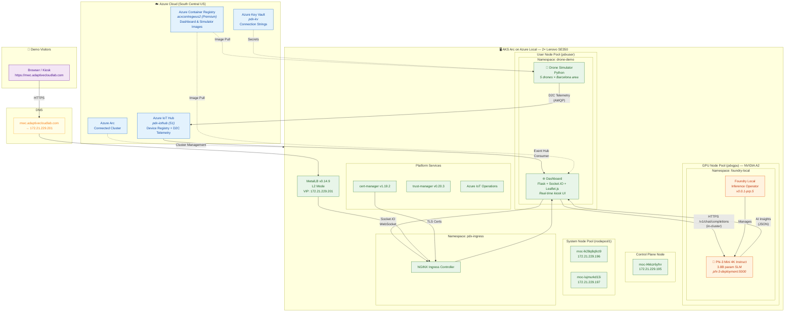

# Architecture Diagram

```mermaid
graph TB
    subgraph Cloud["☁️ Azure Cloud (South Central US)"]
        IoTHub["Azure IoT Hub<br/><i>pdx-iothub (S1)</i><br/>Device Registry + D2C Telemetry"]
        KV["Azure Key Vault<br/><i>pdx-kv</i><br/>Connection Strings"]
        ACR["Azure Container Registry<br/><i>acxcontregwus2 (Premium)</i><br/>Dashboard & Simulator Images"]
        Arc["Azure Arc<br/>Connected Cluster"]
    end

    subgraph AKSArc["🖥️ AKS Arc on Azure Local — 2× Lenovo SE350"]
        subgraph ControlPlane["Control Plane Node"]
            CP["moc-l4kkzr6yfnr<br/>172.21.229.195"]
        end

        subgraph SystemPool["System Node Pool (nodepool1)"]
            S1Node["moc-lk28q8q9ct9<br/>172.21.229.196"]
            S2Node["moc-lujmurkd13i<br/>172.21.229.197"]
        end

        subgraph UserPool["User Node Pool (pdxuser)"]
            subgraph DroneDemoNS["Namespace: drone-demo"]
                Dashboard["🌐 Dashboard<br/>Flask + Socket.IO + Leaflet.js<br/><i>Real-time kiosk UI</i>"]
                Simulator["📡 Drone Simulator<br/>Python<br/><i>5 drones × Barcelona area</i>"]
            end
        end

        subgraph GPUPool["GPU Node Pool (pdxgpu) — NVIDIA A2"]
            subgraph FoundryNS["Namespace: foundry-local"]
                FoundryOp["Foundry Local<br/>Inference Operator<br/><i>v0.0.1-prp.5</i>"]
                Phi3["🧠 Phi-3 Mini 4K Instruct<br/>3.8B param SLM<br/><i>phi-3-deployment:5000</i>"]
            end
        end

        subgraph IngressNS["Namespace: pdx-ingress"]
            Ingress["NGINX Ingress Controller"]
        end

        MetalLB["MetalLB v0.14.9<br/>L2 Mode<br/>VIP: 172.21.229.201"]

        subgraph Platform["Platform Services"]
            CertMgr["cert-manager v1.19.2"]
            TrustMgr["trust-manager v0.20.3"]
            IoTOps["Azure IoT Operations"]
        end
    end

    subgraph Users["👤 Demo Visitors"]
        Browser["Browser / Kiosk<br/>https://mwc.adaptivecloudlab.com"]
    end

    subgraph DNS["DNS"]
        DNSRecord["mwc.adaptivecloudlab.com<br/>→ 172.21.229.201"]
    end

    %% Data Flow
    Simulator -->|"D2C Telemetry<br/>(AMQP)"| IoTHub
    IoTHub -->|"Event Hub<br/>Consumer"| Dashboard
    Dashboard -->|"HTTPS /v1/chat/completions<br/>(in-cluster)"| Phi3
    Phi3 -->|"AI Insights<br/>(JSON)"| Dashboard
    Dashboard -->|"Socket.IO<br/>WebSocket"| Ingress
    Browser -->|"HTTPS"| DNSRecord
    DNSRecord --> MetalLB
    MetalLB --> Ingress
    Ingress --> Dashboard
    ACR -.->|"Image Pull"| Dashboard
    ACR -.->|"Image Pull"| Simulator
    Arc -.->|"Cluster Management"| AKSArc
    KV -.->|"Secrets"| Simulator
    FoundryOp -->|"Manages"| Phi3
    CertMgr -->|"TLS Certs"| Ingress

    %% Styling
    classDef cloud fill:#E3F2FD,stroke:#1565C0,color:#0D47A1
    classDef edge fill:#E8F5E9,stroke:#2E7D32,color:#1B5E20
    classDef gpu fill:#FFF3E0,stroke:#E65100,color:#BF360C
    classDef user fill:#F3E5F5,stroke:#6A1B9A,color:#4A148C
    classDef dns fill:#FFFDE7,stroke:#F9A825,color:#F57F17

    class IoTHub,KV,ACR,Arc cloud
    class Dashboard,Simulator,Ingress,MetalLB,CertMgr,TrustMgr,IoTOps,CP,S1Node,S2Node edge
    class FoundryOp,Phi3 gpu
    class Browser user
    class DNSRecord dns
```
